### Escuela Colombiana de Ingeniería
### Arquitecturas de Software - ARSW

## Escalamiento en Azure con Maquinas Virtuales, Sacale Sets y Service Plans

## Integrantes: Diego Chicuazuque y Juan Cancelado

### Dependencias
* Cree una cuenta gratuita dentro de Azure. Para hacerlo puede guiarse de esta [documentación](https://azure.microsoft.com/es-es/free/students/). Al hacerlo usted contará con $100 USD para gastar durante 12 meses.
Antes de iniciar con el laboratorio, revise la siguiente documentación sobre las [Azure Functions](https://www.c-sharpcorner.com/article/an-overview-of-azure-functions/)

### Parte 0 - Entendiendo el escenario de calidad

Adjunto a este laboratorio usted podrá encontrar una aplicación totalmente desarrollada que tiene como objetivo calcular el enésimo valor de la secuencia de Fibonnaci.

**Escalabilidad**
Cuando un conjunto de usuarios consulta un enésimo número (superior a 1000000) de la secuencia de Fibonacci de forma concurrente y el sistema se encuentra bajo condiciones normales de operación, todas las peticiones deben ser respondidas y el consumo de CPU del sistema no puede superar el 70%.

### Escalabilidad Serverless (Functions)

1. Cree una Function App tal cual como se muestra en las  imagenes.

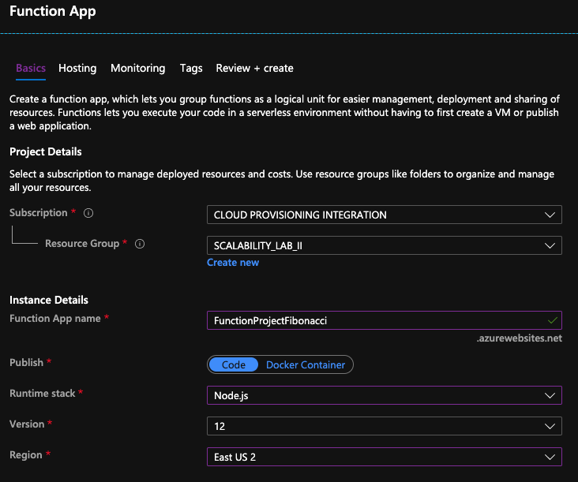

Solución:

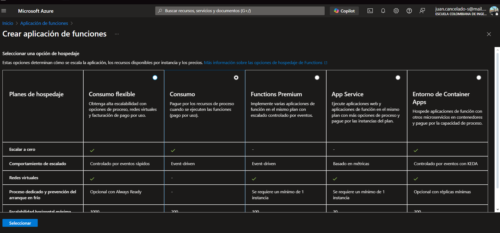

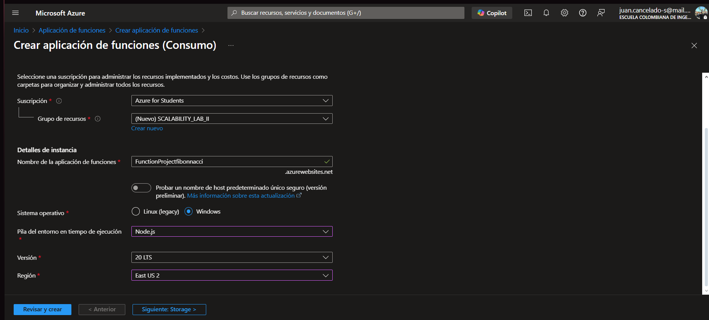

2. Instale la extensión de **Azure Functions** para Visual Studio Code.

Solución:

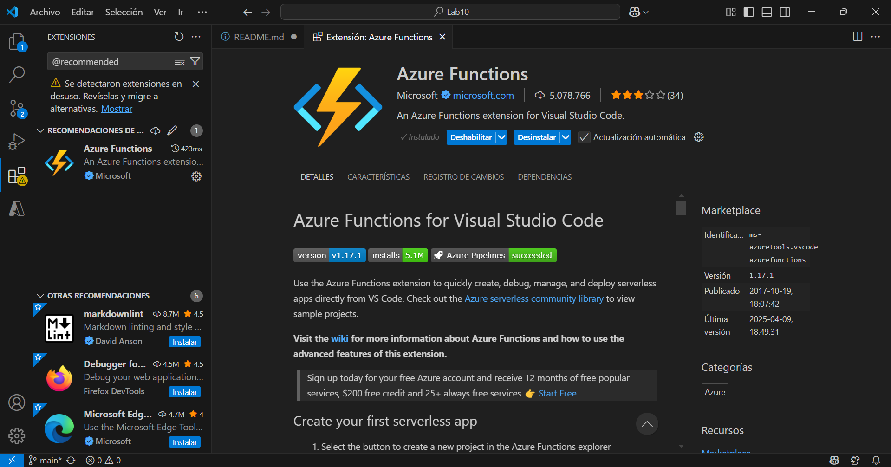

3. Despliegue la Function de Fibonacci a Azure usando Visual Studio Code. La primera vez que lo haga se le va a pedir autenticarse, siga las instrucciones.

Solución:

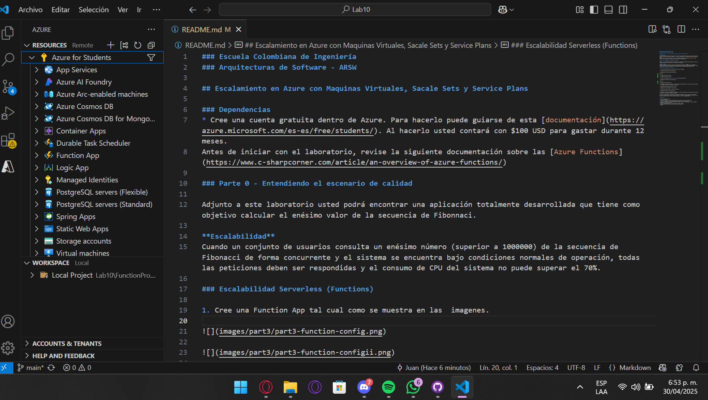

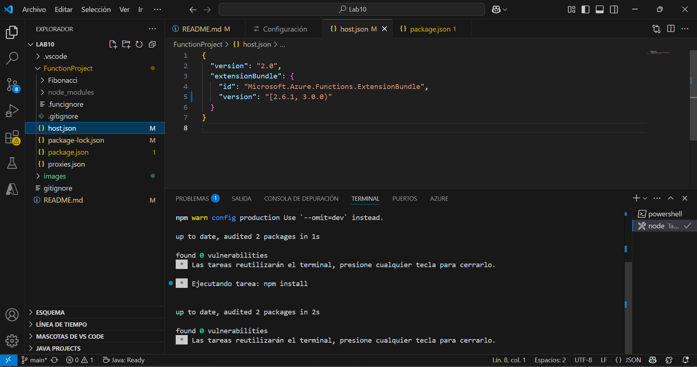

4. Dirijase al portal de Azure y pruebe la function.

Solción:

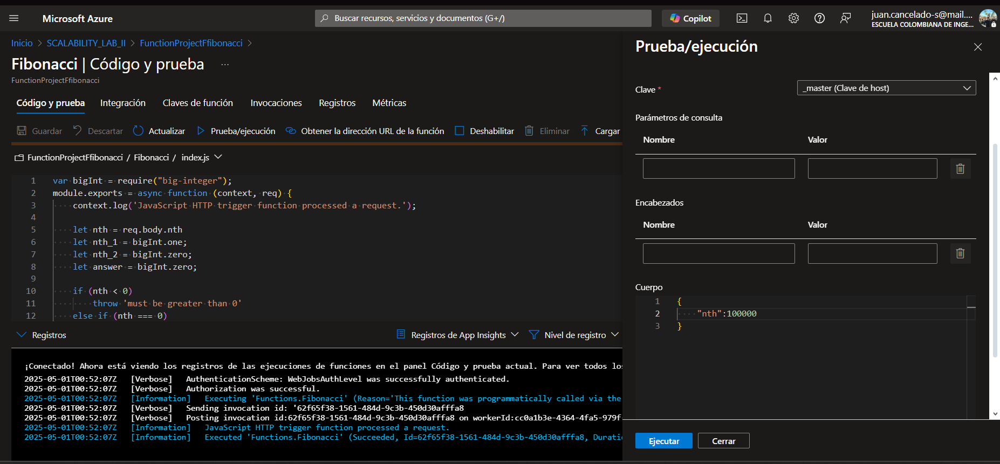

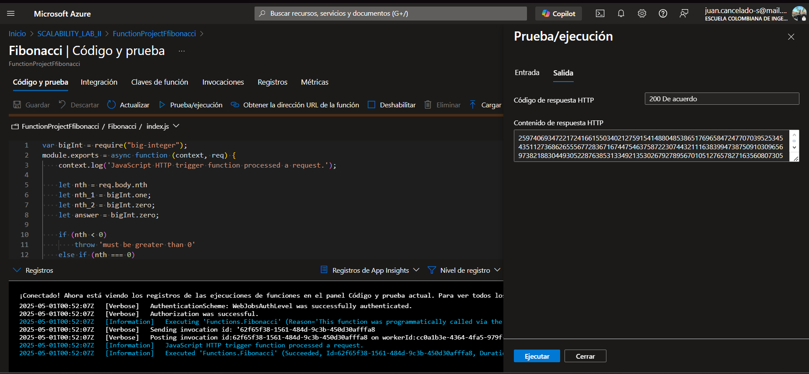

5. Modifique la coleción de POSTMAN con NEWMAN de tal forma que pueda enviar 10 peticiones concurrentes. Verifique los resultados y presente un informe.

Solución:

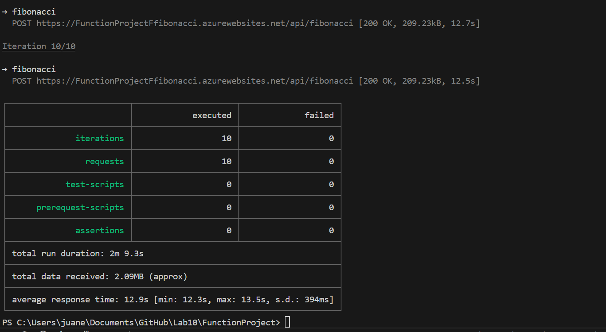

6. Cree una nueva Function que resuleva el problema de Fibonacci pero esta vez utilice un enfoque recursivo con memoization. Pruebe la función varias veces, después no haga nada por al menos 5 minutos. Pruebe la función de nuevo con los valores anteriores. ¿Cuál es el comportamiento?.

Solución:

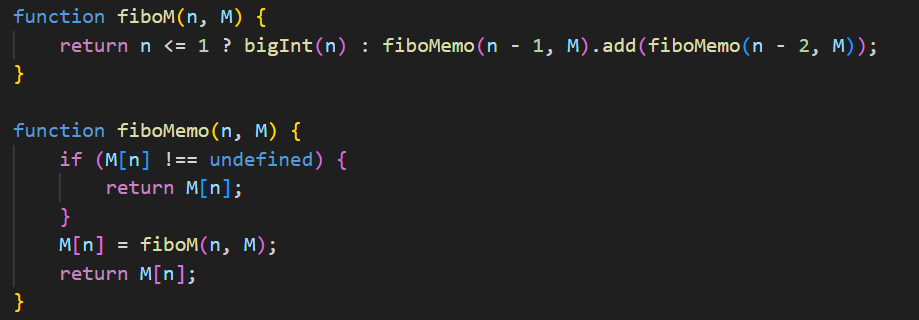

**Preguntas**

* ¿Qué es un Azure Function?

Azure Function es un servicio de cómputo de Microsoft Azure que permite ejecutar pequeñas unidades de código conocidas como funciones sin tener que preocuparse por la infraestructura subyacente. Pertenece al modelo de programación serverless (sin servidor), en el cual los desarrolladores escriben código que responde a eventos o disparadores (triggers), mientras que Azure administra automáticamente el aprovisionamiento, la escalabilidad, la disponibilidad y el mantenimiento del entorno de ejecución.

Este modelo permite que los desarrolladores se centren exclusivamente en la lógica del negocio, sin necesidad de gestionar servidores, máquinas virtuales ni contenedores.

* ¿Qué es serverless?

Serverless (o computación sin servidor) es un modelo de computación en la nube donde el proveedor del servicio (como Microsoft Azure, AWS o Google Cloud) gestiona automáticamente toda la infraestructura subyacente —servidores, redes, escalado, mantenimiento y más—, permitiendo que los desarrolladores se concentren exclusivamente en escribir y desplegar código.

* ¿Qué es el runtime y que implica seleccionarlo al momento de crear el Function App?

Runtime en Azure Functions es el entorno de ejecución que interpreta y ejecuta el código de tus funciones, gestionando aspectos como el lenguaje de programación, los disparadores (triggers), el escalado automático y la integración con otros servicios. Al seleccionarlo al crear una Function App, defines el lenguaje y la versión que se usarán, lo que afecta la compatibilidad, el desarrollo y el despliegue de las funciones.
Cuando creas una Function App (que es el contenedor lógico para tus funciones en Azure), debes elegir un runtime específico

* ¿Por qué es necesario crear un Storage Account de la mano de un Function App?

Es necesario crear un Storage Account junto con una Function App porque Azure Functions lo utiliza internamente para varios propósitos esenciales del funcionamiento de la aplicación.

Almacenamiento del estado y administración del runtime: Guarda archivos de configuración, código, paquetes y otros artefactos necesarios para ejecutar las funciones.

Gestión de triggers y bindings: Para tipos de funciones que dependen de temporizadores, colas, blobs, etc., el Storage Account se usa para rastrear eventos y coordinar la ejecución.

Escalado y concurrencia: Se utiliza para administrar colas internas y coordinar instancias de funciones durante el escalado automático.

Diagnóstico y logging: Guarda logs, métricas y datos de diagnóstico si se habilita Application Insights o algún sistema de monitoreo.

* ¿Cuáles son los tipos de planes para un Function App?, ¿En qué se diferencias?, mencione ventajas y desventajas de cada uno de ellos.

Azure Functions ofrece tres tipos principales de planes de hospedaje para ejecutar tus funciones, cada uno diseñado para diferentes necesidades de escalabilidad, rendimiento y control sobre los recursos:

 1. Plan de Consumo
 El plan predeterminado y más económico. Las funciones se ejecutan bajo demanda, escalan automáticamente y no incurren en costos cuando están inactivas.
 2. Plan Premium 
 Combina la escalabilidad automática del plan de consumo con funciones adicionales como instancias precalentadas, mayor duración de ejecución y conectividad VNET.
 3. Plan de App Service
 Utiliza un App Service Plan tradicional (como Web Apps), en el que pagas por las instancias reservadas constantemente activas.

* ¿Por qué la memoization falla o no funciona de forma correcta?
La memoización puede fallar o no funcionar correctamente por varias razones relacionadas con cómo se almacenan y reutilizan los resultados de funciones. Aquí te explico los motivos más comunes:

Entrada no determinista
Si una función depende de algo más que sus argumentos (por ejemplo, datos globales, fechas, o entradas aleatorias), entonces memorizar el resultado no sirve porque puede cambiar aunque los argumentos sean los mismos.

Argumentos mutables o complejos
Si pasas objetos, arrays o funciones como argumentos y estos cambian (mutan), el sistema de memoización puede fallar al identificar correctamente si ya se ha calculado ese resultado antes.

Almacenamiento inadecuado de caché
El algoritmo de memoización puede tener errores o ser muy simple, usando por ejemplo Map sin clave adecuada, o una estructura sin manejo correcto de las referencias.

Funciones puramente impuras
Si la función tiene efectos secundarios (como modificar una variable global o escribir en un archivo), memorizarla no evitará que esos efectos ocurran si no se controla correctamente.

Límites de memoria o limpieza de caché
Algunas implementaciones usan cachés con límites (LRU, TTL), lo que puede hacer que se pierdan resultados antes de reutilizarlos.

Memoización aplicada a funciones incorrectas
Aplicar memoización a funciones que ya son muy rápidas o que no se llaman repetidamente con los mismos valores es inútil y no mejora el rendimiento.

* ¿Cómo funciona el sistema de facturación de las Function App?

El sistema de facturación de Azure Function App depende del plan de hospedaje: en el plan de consumo se cobra por número de ejecuciones, duración y memoria usada; en el plan premium y dedicado, se factura por instancias reservadas y uso constante de recursos. Además, se cobran servicios asociados como almacenamiento y monitoreo si se utilizan.

* Informe

1000

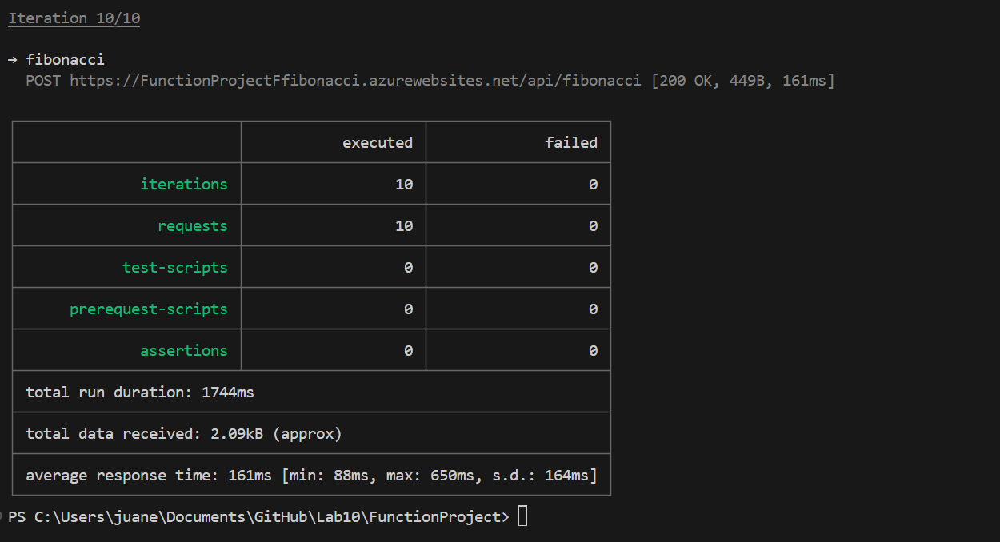

10000

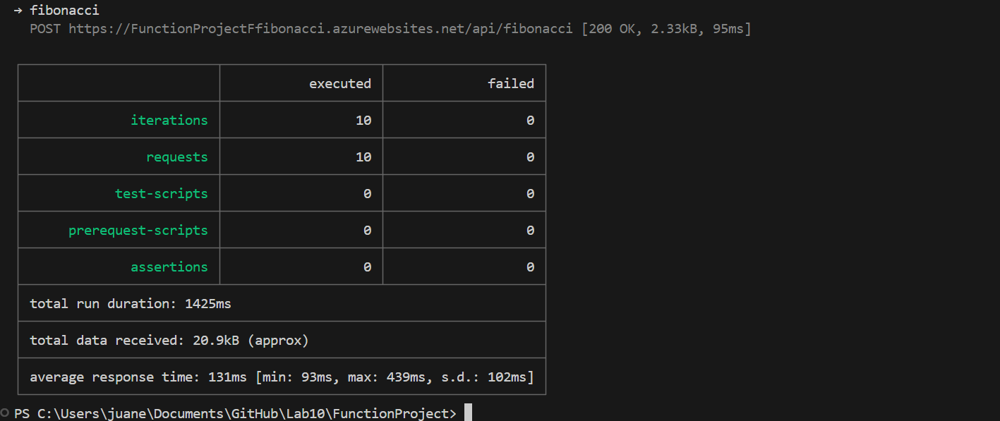

50000

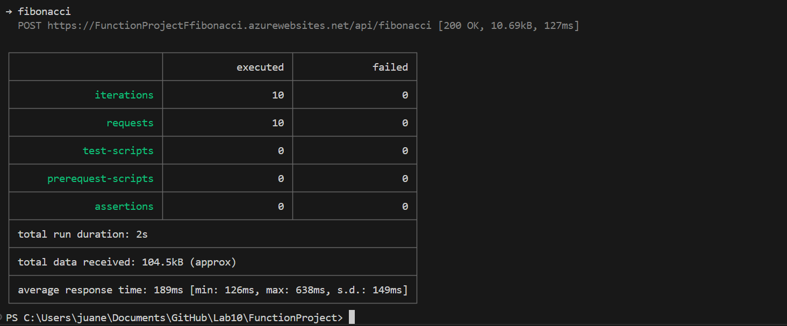

Metricas:

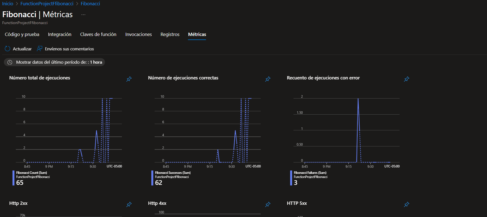